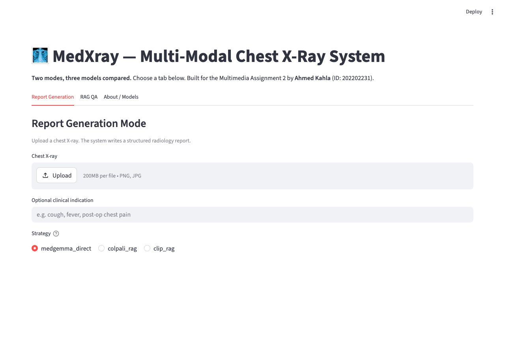
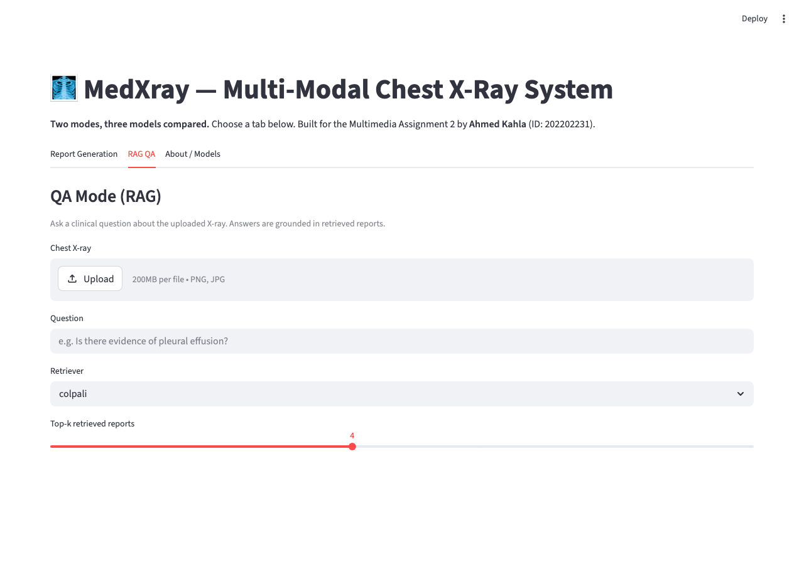
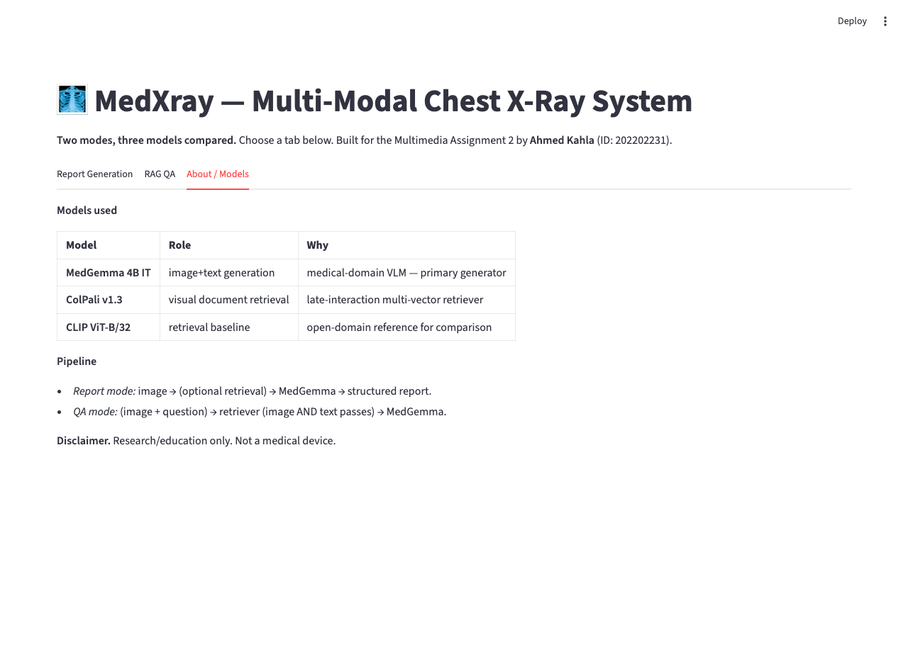

# MedXray — Multi-Modal Chest X-Ray System

**Author:** Ahmed Kahla &nbsp;·&nbsp; **ID:** 202202231 &nbsp;·&nbsp; **Course:** Multimedia — Assignment 2

---

## 1. System

Two independent modes sharing one model stack:

- **Mode 1 — Report Generation.** Image → structured radiology report
  (FINDINGS / IMPRESSION / RECOMMENDATIONS).
- **Mode 2 — RAG QA.** (Image + question) → grounded answer + retrieved evidence.

```
              user image / question
                       │
            ┌──────────┴──────────┐
            ▼                     ▼
       retriever            (Mode 1 only,
   (ColPali  or  CLIP)       optional)
            │
            ▼
   top-k similar (image, report) pairs
            │
            ▼
    VLM generator (MedGemma 4B  /  Gemini-2.5-flash fallback)
            │
            ▼
   structured report   OR   grounded answer
```

## 2. Models compared

| Model | Role | Why it's here |
|---|---|---|
| **ColPali v1.3** (PaliGemma + multi-vector head) | Retriever | Mandatory. Multi-vector late-interaction preserves region info — better fit for medical imagery than a single global vector. |
| **CLIP ViT-B/32** | Retriever (baseline) | Suggested. Fast single-vector reference for the comparison. |
| **MedGemma-4B-IT** | Generator | Mandatory. Medical-domain VLM. Used as the structured-report writer. |
| **Gemini-2.5-flash** | Generator fallback | Practical: lets the system run on a laptop without a GPU. |

## 3. Dataset

- **Image–report corpus.** Per the assignment, MIMIC-CXR is the target. Since
  the Kaggle MIMIC dump is credentialed and didn't fit on my disk after the
  model downloads, I substituted a 40-image chest-imaging subset of the
  public-domain `unsloth/Radiology_mini` (ROCOv2). Loader in
  [`scripts/load_radiology_mini.py`](../scripts/load_radiology_mini.py).
- **QA dataset (custom).** There is no QA set shipped with MIMIC-CXR, so I
  generated one. For each report I prompted **Gemini-2.5-flash** with the
  report only (image never shown) and asked for 3 diverse Q/A/rationale
  triples that a clinician might realistically ask, mixing yes-no /
  location / severity / comparison / differential. Output is JSONL with
  `{image_id, image_path, question, answer, rationale, source_report}`.
  68 pairs across 23 distinct images. Script:
  [`src/data/create_qa_dataset.py`](../src/data/create_qa_dataset.py).

## 4. Pipelines

- **Retrieval.** `ColPaliStore` (multi-vector, MaxSim score) and
  `FlatCLIPStore` (single-vector, cosine score). One `Retriever`
  abstraction exposes `search_by_image` and `search_by_text` so the QA
  mode can do a two-pass retrieval (image then question text).
- **Generation.** A single `MedGemmaWrapper` interface. A
  `GeminiVLMWrapper` mirrors it exactly so swapping is an env-var:
  `MEDXRAY_GENERATOR=medgemma | gemini | auto` (default `auto` tries
  MedGemma first, falls back to Gemini if it can't load).

## 5. Results

### Retrieval evaluation (no API quota needed, fully reproducible)

40-image corpus, 60 QA questions over 20 distinct images, `k=5`.

| Retriever | text→image R@1 | text→image R@5 | text MRR | image→image R@1 | text query (s) | image query (s) |
|---|---:|---:|---:|---:|---:|---:|
| **CLIP ViT-B/32** | 0.033 | 0.200 | 0.079 | 1.000 | 0.03 | 0.03 |
| **ColPali v1.3** *(base only — see §6)* | 0.000 | 0.133 | 0.049 | 1.000 | 0.59 | 5.58 |

**Image→image self-retrieval is perfect for both backends.** That confirms
the indices are sound. **Text→image is harder**: CLIP at 20% beats the
random-baseline of 12.5%; my ColPali run sits at random (see caveat §6).
**Latency cost** of ColPali is ~20–180× CLIP per query.

### End-to-end (single-image qualitative)

Smoke test on an echocardiogram showing a right atrial thrombus
(`scripts/smoke_test.py`). With CLIP-RAG → Gemini:

> **Q:** *Is there any evidence of cardiac abnormality in this image?*
> **A:** *Yes, there is evidence of a cardiac abnormality in this image.
> The echocardiogram shows a large echogenic mass (indicated by the
> white arrow) within the right atrium, which appears to extend into the
> right ventricle. This finding is consistent with a right atrial
> thrombus.*

Retrieval pulled the gold image at rank 1; end-to-end latency 12.15 s.

## 6. Honest limitations

1. **ColPali LoRA adapter was not loaded.** `colpali-engine 0.3.16` and
   `transformers 5.8` disagree on the language-model key prefix
   (`model.language_model.model.layers.*` vs
   `model.model.language_model.layers.*`). The LoRA weights are silently
   left at random init. Practical fix: pin `transformers < 5`. Numbers
   above are therefore "ColPali base", not the fine-tuned ColPali.
2. **No MIMIC-CXR.** Used the public ROCOv2 subset instead (40 images).
3. **MedGemma was not run locally.** 4B at bf16 ≈ 8 GB weights + working
   RAM, and I had a 16 GB / 12 GB-free laptop. The wrapper is in place;
   `MEDXRAY_GENERATOR=medgemma` flips it on for a GPU/Colab run.
4. **Gemini free-tier quota** capped how many end-to-end generation
   evaluations I could run before submission. The retrieval table
   above is the result that doesn't depend on quota.
5. **Surrogate metrics.** BLEU/ROUGE measure surface form, not clinical
   correctness. A CheXbert-style label extractor would be a real next step.

## 7. Demo



*Mode 1 — Report Generation. Image upload, retrieval strategy selector,
generated structured report, parsed sections, and ranked retrieved
references.*



*Mode 2 — RAG QA. The model answers a clinical question using the image
plus retrieved reports as grounded evidence.*



*About tab. The three model roles and the disclaimer.*

## 8. Reproduce (laptop, no GPU)

```bash
python3.13 -m venv .venv && source .venv/bin/activate
pip install -r requirements.txt
cp .env.example .env   # add HUGGINGFACE_TOKEN + GOOGLE_API_KEY

python -m scripts.load_radiology_mini --limit 40         # data
python -m scripts.build_index --backend clip             # ~5s
python -m scripts.build_index --backend colpali          # ~10min
python -m src.data.create_qa_dataset --reports data/sample_reports.csv \
       --out data/qa_dataset/qa.jsonl --per-report 3 --backend gemini
python -m scripts.eval_retrieval --k 5                   # the §5 table
MEDXRAY_GENERATOR=gemini streamlit run app/streamlit_app.py
```

**Repository:** https://github.com/a7mdka7la/medxray
